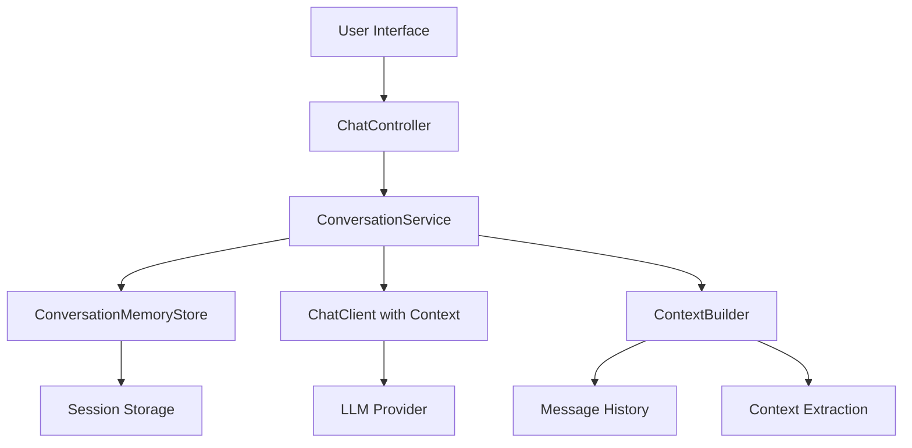

# Design Document

## Overview

The conversational memory feature will enhance the existing Spring Boot chat application by maintaining conversation context across multiple interactions within a chat session. The design leverages Spring's session management capabilities and integrates seamlessly with the existing ChatController and streaming architecture.

The solution implements a session-based conversation history store that captures user messages and AI responses, making this context available to the LLM for generating contextually aware responses. The design maintains the existing HTMX-based streaming UI while adding memory capabilities behind the scenes.

## Architecture

### High-Level Architecture



### Session Management Strategy

The application will use HTTP sessions to maintain conversation state per user session. Each session will have:
- Unique session identifier
- Conversation history (user messages + AI responses)
- Context metadata (topics, entities, user preferences)
- Session lifecycle management

### Memory Storage Approach

**In-Memory Session Storage**: For the initial implementation, conversation history will be stored in HTTP session attributes. This provides:
- Simple implementation with Spring Session
- Automatic cleanup when sessions expire
- No external dependencies
- Suitable for single-instance deployments

**Future Extensibility**: The design allows for easy migration to persistent storage (Redis, Database) for multi-instance deployments.

## Components and Interfaces

### 1. ConversationMemory Model

```java
public class ConversationMemory {
    private String sessionId;
    private List<ConversationMessage> messages;
    private Map<String, Object> contextMetadata;
    private LocalDateTime lastActivity;
    
    // Methods for adding messages, extracting context, etc.
}

public class ConversationMessage {
    private String role; // "user" or "assistant"
    private String content;
    private LocalDateTime timestamp;
    private Map<String, Object> metadata;
}
```

### 2. ConversationService

Primary service for managing conversation memory and context:

```java
@Service
public class ConversationService {
    // Store and retrieve conversation history
    public void addUserMessage(String sessionId, String message);
    public void addAssistantMessage(String sessionId, String response);
    
    // Build context for LLM
    public String buildContextualPrompt(String sessionId, String currentMessage);
    
    // Memory management
    public ConversationMemory getConversationMemory(String sessionId);
    public void clearConversation(String sessionId);
}
```

### 3. ConversationMemoryStore

Handles the actual storage and retrieval of conversation data:

```java
@Component
public class ConversationMemoryStore {
    // Session-based storage operations
    public void storeConversation(String sessionId, ConversationMemory memory);
    public ConversationMemory retrieveConversation(String sessionId);
    public void removeConversation(String sessionId);
}
```

### 4. ContextBuilder

Responsible for creating contextual prompts from conversation history:

```java
@Component
public class ContextBuilder {
    // Build context-aware prompts
    public String buildPromptWithContext(ConversationMemory memory, String currentMessage);
    
    // Extract and maintain context metadata
    public void extractContextFromMessage(String message, Map<String, Object> contextMetadata);
}
```

## Data Models

### ConversationMemory Structure

```json
{
  "sessionId": "session-12345",
  "messages": [
    {
      "role": "user",
      "content": "I am not good at python",
      "timestamp": "2025-01-15T10:30:00",
      "metadata": {}
    },
    {
      "role": "assistant", 
      "content": "I understand you're looking to improve your Python skills...",
      "timestamp": "2025-01-15T10:30:15",
      "metadata": {}
    }
  ],
  "contextMetadata": {
    "userSkills": ["python: beginner"],
    "topics": ["programming", "python"],
    "preferences": {}
  },
  "lastActivity": "2025-01-15T10:30:15"
}
```

### Context Metadata Schema

The system will track:
- **User Skills/Proficiency**: Extracted statements about user abilities
- **Topics**: Current and previous conversation topics
- **Preferences**: User-stated preferences or requirements
- **Entities**: Important entities mentioned (technologies, concepts, etc.)

## Integration Points

### ChatController Integration

The existing ChatController will be enhanced to:
1. Extract session ID from HTTP request
2. Store user messages before sending to LLM
3. Build contextual prompts using conversation history
4. Store AI responses after receiving from LLM
5. Maintain existing streaming functionality

### Prompt Enhancement Strategy

Instead of sending just the current message to the LLM, the system will:
1. Retrieve conversation history for the session
2. Build a contextual prompt that includes relevant history
3. Format the prompt to help the LLM understand context and references
4. Send the enhanced prompt to maintain existing streaming behavior

Example contextual prompt format:
```
Previous conversation context:
User: "I am not good at python"
Assistant: "I understand you're looking to improve your Python skills..."

Current message: "How can I improve that?"
```

## Error Handling

### Session Management Errors
- **Session Expiration**: Graceful handling when session expires mid-conversation
- **Memory Overflow**: Implement conversation history limits to prevent memory issues
- **Concurrent Access**: Handle multiple requests from same session

### LLM Integration Errors
- **Context Too Large**: Implement context truncation strategies
- **Prompt Building Failures**: Fallback to non-contextual prompts
- **Storage Failures**: Continue operation without memory if storage fails

### Recovery Strategies
- Graceful degradation when memory features fail
- Automatic cleanup of expired conversations
- Error logging without exposing sensitive conversation data

## Testing Strategy

### Unit Testing
- **ConversationService**: Test conversation storage, retrieval, and context building
- **ContextBuilder**: Test prompt construction with various conversation histories
- **ConversationMemoryStore**: Test session storage operations

### Integration Testing
- **ChatController Integration**: Test end-to-end flow with conversation memory
- **Session Management**: Test conversation persistence across multiple requests
- **Streaming Compatibility**: Ensure memory features don't break existing streaming

### Performance Testing
- **Memory Usage**: Test with long conversations to ensure reasonable memory consumption
- **Response Time**: Verify context building doesn't significantly impact response times
- **Concurrent Sessions**: Test multiple simultaneous conversations

### User Experience Testing
- **Context Resolution**: Test that references like "that", "it" are properly resolved
- **Conversation Flow**: Test natural conversation progression with memory
- **Edge Cases**: Test with ambiguous references, topic changes, etc.

## Performance Considerations

### Memory Management
- **History Limits**: Implement configurable limits on conversation history length
- **Context Truncation**: Intelligent truncation of old context when limits are reached
- **Session Cleanup**: Automatic cleanup of expired conversations

### Response Time Optimization
- **Efficient Context Building**: Optimize prompt construction to minimize processing time
- **Lazy Loading**: Load conversation history only when needed
- **Caching**: Cache frequently accessed conversation metadata

### Scalability Considerations
- **Session Storage**: Design allows migration to distributed session storage
- **Memory Footprint**: Monitor and optimize memory usage per session
- **Concurrent Access**: Handle multiple requests per session efficiently